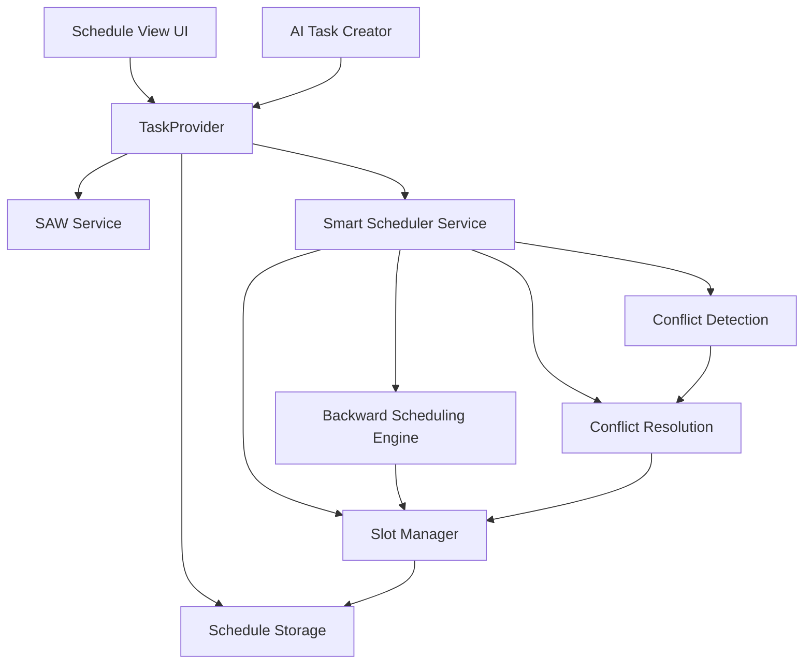
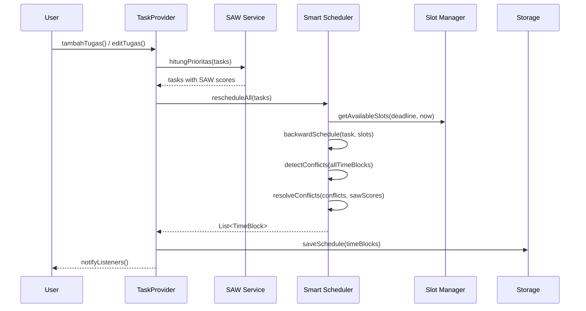
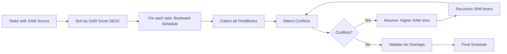

# Design Document: Smart Scheduling

## Overview

Smart Scheduling menambahkan kemampuan penjadwalan cerdas pada aplikasi Tugasku. Fitur ini mengalokasikan Time Block (slot 1 jam) secara otomatis menggunakan algoritma backward scheduling dari deadline, dengan conflict resolution berbasis SAW Score yang sudah ada.

**Prinsip Utama:**
1. **Strict Monotasking** — Satu slot waktu hanya untuk satu tugas
2. **24-Hour Flexibility** — Sistem terbuka 24 jam, Primary Work Hours hanya preferensi
3. **Priority-Based Scheduling** — SAW Score sebagai hakim saat konflik

**Integrasi:**
- Menggunakan `SAWService.hitungPrioritas()` yang sudah ada untuk mendapatkan SAW Score
- Menggunakan `TaskProvider` sebagai state management utama (ChangeNotifier + Provider)
- Persistensi via `SharedPreferences` (konsisten dengan arsitektur existing)

## Architecture

### High-Level Architecture



### Component Interaction Flow



### Design Decisions

| Decision | Choice | Rationale |
|----------|--------|-----------|
| Slot granularity | 1 jam fixed | Sesuai requirement, simplifikasi algoritma, cocok untuk tugas akademik |
| Scheduling trigger | Setiap perubahan tugas | Menjaga konsistensi jadwal dengan prioritas terbaru |
| Storage | SharedPreferences (JSON) | Konsisten dengan arsitektur existing, cukup untuk data lokal |
| State management | Extend TaskProvider | Menghindari fragmentasi state, satu source of truth |
| Conflict resolution | Automatic (no user input) | Sesuai requirement, SAW Score sebagai hakim objektif |
| Primary Work Hours | Soft preference (ordering) | Slot dalam PWH diprioritaskan tapi tidak memblokir slot luar |

## Components and Interfaces

### 1. TimeBlock Model (`lib/models/time_block_model.dart`)

```dart
enum TimeBlockStatus { active, missed, manuallyMoved }

class TimeBlock {
  final String id;
  final String taskId;
  final DateTime startTime;  // Selalu pada jam bulat (e.g., 08:00, 09:00)
  final DateTime endTime;    // startTime + 1 hour
  final TimeBlockStatus status;
  final bool isManuallyPlaced; // True jika user drag-and-drop

  TimeBlock({
    required this.id,
    required this.taskId,
    required this.startTime,
    required this.endTime,
    this.status = TimeBlockStatus.active,
    this.isManuallyPlaced = false,
  });

  // Serialization
  Map<String, dynamic> toJson();
  factory TimeBlock.fromJson(Map<String, dynamic> json);
  TimeBlock copyWith({...});
}
```

### 2. ScheduleConfig Model (`lib/models/schedule_config_model.dart`)

```dart
class ScheduleConfig {
  final int workStartHour;   // Default: 8
  final int workStartMinute; // Default: 0
  final int workEndHour;     // Default: 17
  final int workEndMinute;   // Default: 0

  ScheduleConfig({
    this.workStartHour = 8,
    this.workStartMinute = 0,
    this.workEndHour = 17,
    this.workEndMinute = 0,
  });

  /// Apakah slot tertentu berada dalam Primary Work Hours
  bool isWithinWorkHours(DateTime slotStart);

  /// Mendukung konfigurasi lintas tengah malam (e.g., 22:00-06:00)
  bool get isCrossMidnight => workStartHour > workEndHour || 
    (workStartHour == workEndHour && workStartMinute > workEndMinute);

  // Serialization
  Map<String, dynamic> toJson();
  factory ScheduleConfig.fromJson(Map<String, dynamic> json);
}
```

### 3. Smart Scheduler Service (`lib/services/smart_scheduler_service.dart`)

```dart
class ScheduleResult {
  final List<TimeBlock> timeBlocks;
  final List<ScheduleConflict> conflicts;
  final List<ScheduleWarning> warnings;
}

class ScheduleConflict {
  final String slotTime;       // ISO string of conflicting slot
  final List<String> taskIds;  // Tasks competing for this slot
  final String winnerId;       // Task that won the slot
  final Map<String, double> sawScores; // SAW scores of competing tasks
}

class ScheduleWarning {
  final String taskId;
  final String message;
  final WarningType type;
}

enum WarningType { insufficientSlots, pastDeadline, unschedulable }

class SmartSchedulerService {
  /// Main entry point: reschedule all active tasks
  ScheduleResult rescheduleAll({
    required List<Task> tasks,
    required List<TimeBlock> manualBlocks,
    required ScheduleConfig config,
    required DateTime now,
  });

  /// Backward schedule a single task
  List<TimeBlock> backwardSchedule({
    required Task task,
    required Set<DateTime> occupiedSlots,
    required ScheduleConfig config,
    required DateTime now,
  });

  /// Detect conflicts in a set of time blocks
  List<ScheduleConflict> detectConflicts(List<TimeBlock> allBlocks);

  /// Resolve conflicts using SAW scores
  List<TimeBlock> resolveConflicts({
    required List<TimeBlock> blocks,
    required List<ScheduleConflict> conflicts,
    required List<Task> tasks,
    required Set<DateTime> occupiedSlots,
    required ScheduleConfig config,
    required DateTime now,
  });

  /// Get available slots between now and deadline
  List<DateTime> getAvailableSlots({
    required DateTime from,
    required DateTime until,
    required Set<DateTime> occupiedSlots,
    required ScheduleConfig config,
  });

  /// Validate no overlaps exist in final schedule
  bool validateNoOverlaps(List<TimeBlock> blocks);
}
```

### 4. Extended TaskProvider (`lib/services/task_provider.dart`)

Extends existing TaskProvider with scheduling capabilities:

```dart
// New fields added to TaskProvider
List<TimeBlock> _timeBlocks = [];
ScheduleConfig _scheduleConfig = ScheduleConfig();
final SmartSchedulerService _scheduler = SmartSchedulerService();

// New getters
List<TimeBlock> get timeBlocks => _timeBlocks;
ScheduleConfig get scheduleConfig => _scheduleConfig;
List<TimeBlock> getTimeBlocksForDate(DateTime date);
List<TimeBlock> getTimeBlocksForTask(String taskId);

// New methods
Future<void> _runScheduler();  // Called after SAW recalculation
Future<void> moveTimeBlock(String blockId, DateTime newSlot);
Future<void> deleteTimeBlock(String blockId);
Future<void> updateScheduleConfig(ScheduleConfig config);
Future<void> _saveSchedule();
Future<void> _loadSchedule();
```

### 5. Schedule View (`lib/screens/schedule_screen.dart`)

```dart
class ScheduleScreen extends StatefulWidget {
  // 24-hour timeline view with:
  // - Horizontal swipe for day navigation
  // - Color-coded time blocks by category
  // - Current time indicator
  // - Drag-and-drop support for manual moves
  // - Visual distinction: PWH vs non-PWH, active vs missed
}
```

### 6. AI Task Creator Service (`lib/services/ai_task_creator_service.dart`)

```dart
class AITaskCreatorService {
  /// Extract tasks from text input (syllabus, project brief)
  Future<List<TaskSuggestion>> extractTasks(String inputText);
}

class TaskSuggestion {
  final String namaTugas;
  final DateTime? deadline;
  final int estimasiWaktu;
  final int tingkatKepentingan;
  final int tingkatUrgensi;
  bool isSelected; // For user confirmation UI
}
```

## Data Models

### TimeBlock Storage Schema

```json
{
  "timeBlocks": [
    {
      "id": "uuid-v4",
      "taskId": "task-uuid-v4",
      "startTime": "2024-01-15T08:00:00.000",
      "endTime": "2024-01-15T09:00:00.000",
      "status": 0,
      "isManuallyPlaced": false
    }
  ],
  "scheduleConfig": {
    "workStartHour": 8,
    "workStartMinute": 0,
    "workEndHour": 17,
    "workEndMinute": 0
  }
}
```

### Slot Representation

A slot is represented as a `DateTime` at the hour boundary (minute=0, second=0). For example:
- Slot `2024-01-15T08:00:00` represents the period 08:00–09:00
- Slot `2024-01-15T23:00:00` represents the period 23:00–00:00

### Scheduling Algorithm Data Flow



### Backward Scheduling Algorithm Detail

```
Input: task, occupiedSlots, config, now
Output: List<TimeBlock>

1. deadline = task.deadline
2. estimasi = task.estimasiWaktu (jam)
3. candidateSlots = []
4. cursor = deadline - 1 hour (last slot before deadline)

5. WHILE candidateSlots.length < estimasi AND cursor >= now:
     IF cursor NOT IN occupiedSlots:
       IF config.isWithinWorkHours(cursor):
         candidateSlots.addFirst(cursor)  // Prioritas PWH
       ELSE:
         nonPwhCandidates.add(cursor)     // Backup
     cursor = cursor - 1 hour

6. IF candidateSlots.length < estimasi:
     // Fill remaining from non-PWH candidates (closest to deadline first)
     candidateSlots.addAll(nonPwhCandidates.take(estimasi - candidateSlots.length))

7. IF candidateSlots.length < estimasi:
     emit Warning(insufficientSlots)

8. RETURN candidateSlots.map(slot => TimeBlock(taskId, slot, slot+1h))
```

### Conflict Resolution Algorithm

```
Input: allBlocks, tasks (with SAW scores)
Output: resolvedBlocks (no overlaps)

1. conflicts = detectOverlaps(allBlocks)
2. WHILE conflicts.isNotEmpty:
     FOR each conflict:
       competingTasks = getTasksForBlocks(conflict.blocks)
       winner = competingTasks.maxBy(t => t.sawScore)
       // Tiebreaker: earliest deadline, then earliest createdAt
       losers = competingTasks.where(t != winner)
       
       FOR each loser:
         remove loser's block from conflict slot
         shiftedSlot = findNextAvailableSlot(backward from conflict slot)
         IF shiftedSlot != null:
           allocate loser to shiftedSlot
         ELSE:
           mark loser as "unschedulable", emit warning
     
     conflicts = detectOverlaps(allBlocks)  // Re-check

3. RETURN allBlocks
```

## Correctness Properties

*A property is a characteristic or behavior that should hold true across all valid executions of a system — essentially, a formal statement about what the system should do. Properties serve as the bridge between human-readable specifications and machine-verifiable correctness guarantees.*

### Property 1: Strict Monotasking Invariant (No Overlaps)

*For any* set of tasks with valid deadlines and estimations, after the Smart Scheduler completes scheduling (including conflict resolution), no two TimeBlocks in the resulting schedule shall have overlapping time ranges — every slot contains at most one task.

**Validates: Requirements 2.1, 2.3, 4.4, 4.6**

### Property 2: TimeBlock Duration Invariant

*For any* TimeBlock produced by the Smart Scheduler, the duration (endTime - startTime) shall be exactly 1 hour, and startTime shall always be on an hour boundary (minute=0, second=0).

**Validates: Requirements 1.2, 1.4**

### Property 3: Backward Scheduling Respects Deadline

*For any* task with a future deadline and estimation, all allocated TimeBlocks shall have a startTime strictly before the task's deadline, and no TimeBlock shall have a startTime before the current time.

**Validates: Requirements 1.1, 1.4**

### Property 4: Conflict Resolution Priority Ordering

*For any* two tasks competing for the same slot, the task with the higher SAW Score shall win the slot. If SAW Scores are equal, the task with the earlier deadline shall win. If deadlines are also equal, the task with the earlier createdAt shall win.

**Validates: Requirements 4.2, 8.1, 8.5**

### Property 5: Recursive Shift Produces Valid Placement

*For any* task that loses a slot in conflict resolution, it shall be shifted to an earlier available slot (before the contested slot) that is not occupied and not before current time, or marked as unschedulable if no such slot exists.

**Validates: Requirements 1.3, 4.3, 4.5**

### Property 6: Primary Work Hours Preference Ordering

*For any* scheduling result where both PWH and non-PWH slots are available before the deadline, all PWH slots shall be filled before any non-PWH slot is used for the same task. Non-PWH allocation shall never be blocked or rejected.

**Validates: Requirements 6.2, 6.3, 6.4**

### Property 7: Primary Work Hours Cross-Midnight Correctness

*For any* ScheduleConfig (including cross-midnight configurations like 22:00–06:00), the `isWithinWorkHours` function shall correctly identify whether a given hour falls within the configured range.

**Validates: Requirements 6.1**

### Property 8: Partial Scheduling Maximizes Allocation

*For any* task where the estimation exceeds available slots between current time and deadline, the scheduler shall allocate exactly `min(estimation, availableSlots)` TimeBlocks and emit a warning indicating the shortfall.

**Validates: Requirements 1.5, 1.7**

### Property 9: Manual Block Preservation on Reschedule

*For any* reschedule operation triggered by editing task A, all TimeBlocks of other tasks that were manually placed (isManuallyPlaced=true) shall remain at their original slots unchanged.

**Validates: Requirements 7.5**

### Property 10: Move Validation

*For any* manual move of a TimeBlock: (a) moving to an empty slot before the task's deadline shall succeed and update the block's times; (b) moving to an occupied slot shall be rejected; (c) moving to a slot at or after the task's deadline shall be rejected. In all rejection cases, the block remains at its original position.

**Validates: Requirements 7.1, 7.2, 7.3**

### Property 11: Task Completion Cleanup

*For any* task marked as complete, all TimeBlocks associated with that task shall be removed from the schedule, and their slots shall become available for other tasks.

**Validates: Requirements 7.6**

### Property 12: Missed Block Detection

*For any* TimeBlock whose endTime is before the current time and whose associated task is not marked as complete, the block shall be marked with status "missed".

**Validates: Requirements 9.4**

### Property 13: Estimation Change Reallocates Without SAW Modification

*For any* task whose estimation is changed, the scheduler shall remove all old TimeBlocks for that task and allocate new blocks matching the new estimation count, without modifying the task's SAW Score.

**Validates: Requirements 8.4**

### Property 14: Schedule Serialization Round Trip

*For any* valid list of TimeBlocks and ScheduleConfig, serializing to JSON and deserializing back shall produce an equivalent set of objects (same ids, times, statuses, and config values).

**Validates: Requirements 9.1, 9.6**

## Error Handling

### Scheduling Errors

| Error Condition | Handling | User Feedback |
|----------------|----------|---------------|
| Deadline in the past | Reject scheduling, no blocks created | Error message: "Deadline harus di masa depan" |
| Insufficient slots | Partial schedule + warning | Warning: "{task} membutuhkan {n} jam lagi sebelum deadline" |
| Task unschedulable (no slots at all) | Mark as unschedulable | Warning: "{task} tidak dapat dijadwalkan — tidak ada slot tersedia" |
| SAW Service failure | Retain last valid schedule | Error: "Penjadwalan tidak dapat diperbarui — perhitungan prioritas gagal" |
| Corrupt schedule data on load | Empty schedule, no crash | Info: "Data jadwal tidak tersedia, memulai dengan jadwal kosong" |
| Move to occupied slot | Reject move, keep original | Info: "Slot tujuan sudah terisi oleh tugas lain" |
| Move past deadline | Reject move, keep original | Info: "Pemindahan melampaui deadline tugas" |
| AI extraction failure/timeout | Cancel process, show error | Error: "Ekstraksi gagal — coba perjelas input atau buat tugas manual" |
| AI input too short (<50 chars) | Disable process button | Hint: "Input terlalu pendek untuk diekstrak (minimum 50 karakter)" |

### Rollback Strategy

When post-operation validation detects an overlap (should not happen with correct algorithm, but as safety net):
1. Discard the current operation's changes
2. Restore the previous valid schedule state from the last saved snapshot
3. Display error indicating which slot had a conflict
4. Log the error for debugging

### Graceful Degradation

- If SharedPreferences is unavailable: operate in-memory only, warn user data won't persist
- If AI service is unreachable: disable AI button, allow manual task creation
- If schedule becomes inconsistent: trigger full reschedule from scratch using current tasks and SAW scores

## Testing Strategy

### Property-Based Testing

**Library:** `dart_check` (Dart property-based testing library compatible with Flutter test framework)

**Configuration:**
- Minimum 100 iterations per property test
- Custom generators for Task, TimeBlock, ScheduleConfig, and DateTime (hour-aligned)
- Each test tagged with property reference

**Property Tests (14 properties):**

Each correctness property above maps to one property-based test:
- Tag format: `// Feature: smart-scheduling, Property {N}: {title}`
- Generators produce random valid tasks (1–10 hour estimation, future deadlines, SAW scores 0.0–1.0)
- Slot configurations vary: empty schedules, partially filled, nearly full, cross-midnight PWH

### Unit Tests (Example-Based)

Focus areas:
- UI rendering: Schedule View displays correct blocks per day
- Category color mapping
- Empty state display
- Current time indicator positioning
- Navigation between days
- AI Task Creator input validation (< 50 chars disabled)
- Notification content after conflict resolution

### Integration Tests

- Full flow: add task → SAW calculation → scheduling → persistence → reload
- SAW recalculation triggers rescheduling within 3 seconds
- AI task creation → confirmation → SAW + scheduling pipeline
- SharedPreferences read/write cycle for schedule data

### Edge Case Tests

- Past deadline rejection
- Corrupt JSON data handling (graceful empty state)
- SAW Service failure (schedule preservation)
- AI timeout after 30 seconds
- All 24 slots in a day occupied (task shifts to previous day)
- Two tasks with identical SAW score, deadline, and createdAt (deterministic ordering)
- Cross-midnight Primary Work Hours (22:00–06:00)
- Single hour between now and deadline with 5-hour estimation (partial scheduling)

